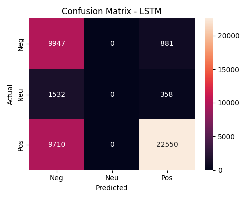
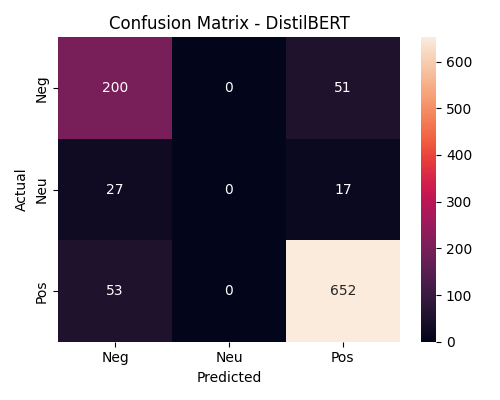
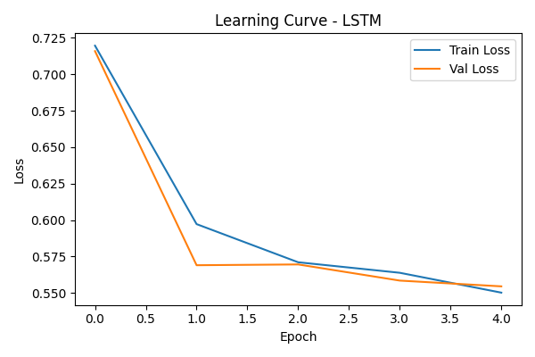
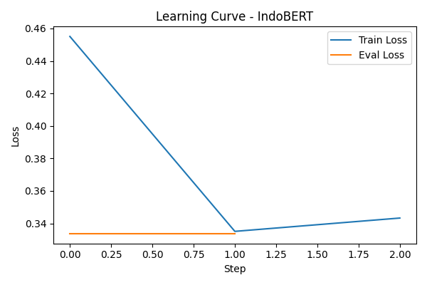

# UAP-Machine-Learning

# 🧠 Ujian Akhir Praktikum – Analisis Sentimen Bahasa Indonesia
## Klasifikasi Sentimen Ulasan Aplikasi Gojek Menggunakan LSTM, IndoBERT, dan DistilBERT

---

## 1️⃣ Biodata

- **Nama**: Muhammad Wildan Baihaqi
- **NIM**: 202210370311151
- **Program Studi**: Informatika  
- **Mata Kuliah**: Pembelajaran Mesin  
- **Tugas**: Ujian Akhir Praktikum (UAP)

---

## 2️⃣ Table of Contents

1. Biodata  
2. Table of Contents  
3. Deskripsi Proyek  
4. Deskripsi Dataset  
5. EDA & Preprocessing  
6. Deskripsi Model  
7. Evaluasi Model  
8. Confusion Matrix  
9. Learning Curves  
10. Analisis Hasil  
11. Sistem Streamlit  
12. Cara Menjalankan Streamlit Secara Lokal  

---

## 3️⃣ Deskripsi Proyek

Proyek ini bertujuan untuk melakukan **klasifikasi sentimen teks berbahasa Indonesia** pada ulasan pengguna aplikasi **Gojek**.  
Sentimen dibagi menjadi tiga kelas:

- **Negative**
- **Neutral**
- **Positive**

Pendekatan yang digunakan mencakup model **non-pretrained** dan **pretrained (transfer learning)** untuk membandingkan performa klasifikasi.

---

## 4️⃣ Deskripsi Dataset

Dataset berupa ulasan pengguna aplikasi Gojek yang diperoleh dari Google Play Store.

**Informasi Dataset:**
- Jumlah data: ±225.000 ulasan
- Bahasa: Indonesia
- Kolom utama:
  - `content` → teks ulasan
  - `score` → rating pengguna

**Mapping Label Sentimen:**
- Rating 1–2 → Negative  
- Rating 3 → Neutral  
- Rating 4–5 → Positive  

🔗 **Link Dataset (Google Drive):**  
👉 [(https://drive.google.com/file/d/1Fg_RoTMPgbG2sZ3WlK5HdXaFRrbLWUDB/view?usp=sharing)](https://drive.google.com/file/d/1Fg_RoTMPgbG2sZ3WlK5HdXaFRrbLWUDB/view?usp=sharing)

---

## 5️⃣ Exploratory Data Analysis (EDA) & Preprocessing

Tahapan preprocessing yang dilakukan:
- Penghapusan kolom yang tidak relevan
- Pembersihan teks (lowercase, punctuation removal)
- Stopword removal (Bahasa Indonesia)
- Label encoding
- Tokenisasi teks
- Padding & truncation

EDA mencakup:
- Distribusi kelas sentimen
- Panjang teks ulasan
- Analisis ketidakseimbangan data

---

## 6️⃣ Deskripsi Model yang Digunakan

### 🔹 1. LSTM (Non-Pretrained)
- Arsitektur: Embedding → LSTM → Dense
- Digunakan sebagai baseline model
- Dilatih dari awal tanpa bobot pretrained

### 🔹 2. IndoBERT (Pretrained)
- Model: `indobenchmark/indobert-base-p1`
- Fine-tuning untuk sentiment classification
- Dirancang khusus untuk Bahasa Indonesia

### 🔹 3. DistilBERT (Pretrained)
- Model: `distilbert-base-multilingual-cased`
- Versi ringan dari BERT
- Lebih efisien secara komputasi dengan performa kompetitif

---

## 7️⃣ Evaluasi Model

Evaluasi dilakukan menggunakan metrik:
- Accuracy
- Precision (Macro)
- Recall (Macro)
- F1-score (Macro)

### 📊 Tabel Perbandingan Performa Model  
*(Hasil langsung dari output kode Python)*

| Model | Accuracy | Precision (Macro) | Recall (Macro) | F1-score (Macro) |
|------|----------|------------------|---------------|-----------------|
| LSTM | 0.722509 | 0.472453 | 0.539215 | 0.475337 |
| IndoBERT | 0.889000 | 0.566605 | 0.617884 | 0.589231 |
| DistilBERT | 0.852000 | 0.539947 | 0.573878 | 0.556128 |

---

## 8️⃣ Confusion Matrix (Hasil Kode)

### 🔹 LSTM


### 🔹 IndoBERT


### 🔹 DistilBERT


Gambar confusion matrix diperoleh langsung dari visualisasi hasil prediksi model menggunakan `seaborn` dan `matplotlib`.

---

## 9️⃣ Learning Curves (Hasil Kode)

### 🔹 LSTM


### 🔹 IndoBERT


### 🔹 DistilBERT


Learning curve digunakan untuk menganalisis proses konvergensi dan stabilitas training masing-masing model.

---

## 🔟 Analisis Hasil

Berdasarkan hasil eksperimen:
- Model pretrained (IndoBERT dan DistilBERT) menunjukkan performa yang lebih baik dibandingkan LSTM.
- IndoBERT memberikan performa terbaik karena dilatih khusus untuk Bahasa Indonesia.
- DistilBERT menawarkan trade-off yang baik antara performa dan efisiensi komputasi.
- LSTM cenderung bias terhadap kelas mayoritas akibat ketidakseimbangan data.

---

## 1️⃣1️⃣ Sistem Streamlit

Aplikasi Streamlit dibuat untuk:
- Menampilkan EDA dataset
- Memilih model (LSTM / IndoBERT / DistilBERT)
- Melakukan prediksi sentimen dengan **input teks manual**

---

## 1️⃣2️⃣ Cara Menjalankan Streamlit Secara Lokal

### 1. Clone Repository
 download model : https://drive.google.com/drive/folders/11lNe7TLyZCEIZtYFOvyho1FsVNf9zXQR?usp=sharing
```bash
git clone https://github.com/username/uap-sentiment-gojek.git
cd uap-sentiment-gojek
